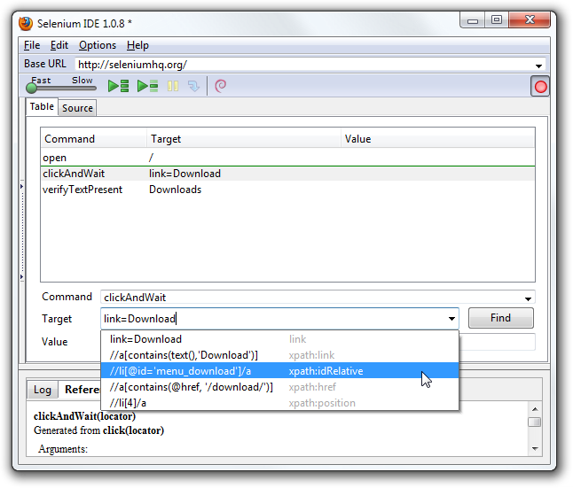

调试是发现错误和修复错误，是测试案例开发过程中的常见动作。

这里不打算介绍如何调试，很多 Selenium 的新手也已经具备基本的调试经验。如果调试对于你是全新的领域，建议你向公司里的开发人员请教。

**断点和起点**

---
Selenium IDE 通过设置断点可以让运行中的测试脚本在断点处暂停执行或者继续执行。通过断点，你可以让自动化脚本运行在特定的命令处暂停，可以观察该脚本在这个点上的行为。要做到这一点，需要在待观察的命令前一条命令处设置断点。

设置一个断点，需要在表格视图选择一条命令，单击鼠标右键，从上下文菜单中选择“Toggle Breakpoint”。然后点击运行按钮，运行脚本，脚本将会从第一个测试案例脚本的第一行一直运行到断点处。

有些时候需要从测试案例脚本的中间某行开始运行，一直运行到最后一行。或者从测试案例脚本的中间某行开始运行，一直运行到断点处。这个时候设置起始点就很有用处了。举一个常见的例子，假设你的测试案例需要先登录网站，然后执行一系列测试。现在你需要对登录后的测试案例进行调试，通过在登录测试脚本之后设置起始点，这样你调试脚本的时候，就不用每次都从登录开始执行测试案例，因为，你在登录之前势必要先退出登录，这就省去每次退出登录了。

设置一个起始点，先选中一个命令，在该命令上点击鼠标右键，在上下文菜单中选择“Set/Clear Start Point”。然后点击运行按钮，测试案例从起始点开始运行了。

**单步执行**

---
通过下面的步骤和方法，可以一次执行测试案例的一个命令，也就是所谓的单步执行：
1. 通过工具栏的启动按钮，启动测试脚本的执行；

2. 通过工具栏的暂停按钮，快速暂停测试脚本的执行；

3. 重复的点击单步执行按钮，点击一次，执行一个测试脚本中的命令。

**Find按钮**

---
“Find” 按钮用来查看当前选中的 Selenium 命令所操作的 web 页面上的 UI 元素。对于一个命令，如果第一个参数是定位器，这个工具用来验证定位器是否正确很有用。这个按钮可以用在所有需要操作 UI 界面元素的命令上，例如：click, clickAndWait, 以及相应的断言和验证命令。

从表格视图上，选择带有定位器参数的一个命令，点击 “Find” 按钮，现在观察页面。在定位器所标识的页面元素周围有一个绿色的方框包围。

**页面源代码**

---
在调试测试脚本时，经常需要查看被测网页的源代码来定位问题。火狐浏览器查看网页源代码非常容易。只要在被测网页上点击鼠标右键选择“查看网页源代码”，网页源代码会显示在另外一个窗口中，使用查找功能可以找到 HTML 代码中的指定 UI 元素的信息。  

另一种方式，选择网页上感兴趣的部分元素，点击鼠标右键选择“查看选中部分源代码”，火狐浏览器打开一个新窗口，只有一部分网页 HTML 代码显示出来，其中选中部分 UI 界面元素的网页 HTML 代码被高亮显示出来了。

**辅助定位**

---
当 Selenium IDE 录制一个有定位类型参数的命令时，他会存储一些额外的定位信息，允许用户去替换选择可能的定位参数。此功能有利于我们学习掌握更多关于定位器的知识，并且经常可以用来辅助修改录制好的测试脚本。

这个定位器辅助工具在 Selenium IDE 窗口上命令字段下面的 Target（目标）字段的右边，是一个下拉列表。只有当 Target（目标）字段录制的时候是定位器时，这个辅助工具才会生效。

---
[警告、弹窗和多个窗口](Alert.md) | [目录](README.md) | [编写测试套件](Suites.md)
